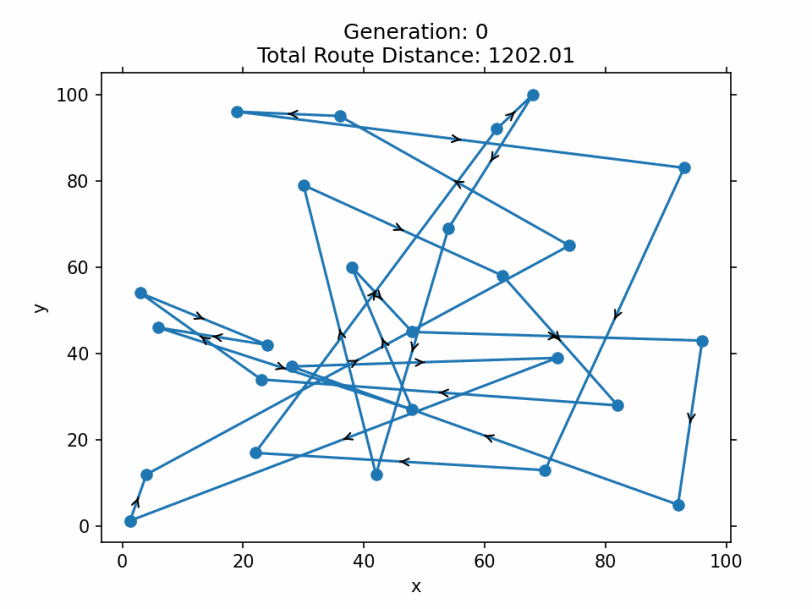

# ACSE-9 Independent Research Project 2021

## An investigation into drone delivery in urban and rural areas
## Dependencies
This code has been compiled with C++20

## Introduction
Software for delivery of parcels with the use of autonomous drones or otherwise known as UAVs. The software is able to read in data from the text file "postal_data.txt" and formulate an optimal route for a delivery trucks of drones & parcels to take and calculates the total predicted cost of the journey. Unlike in other drone delivery software, a drone can be used to deliver to more than one address on its flight path given that the total distance and parcel mass for the drone is under the specified limits. This maximises the usage of a single drone. Delivery trucks are limited by their volume capacity on how many drones & parcels they can hold. With allowing a drone to fly to more than one address if possible, it reduces the total number of drones required to deliver to the addresses in "postal_data.txt" and reduces the total cost of the journey.

## Results
Savings on electricty when using single address drone method and multi address drone method.

  

Savings on number of drones & trucks required for test case.

  

Optimisation of a truck route with 22 stop off locations.

  

## Documentation
Full and extensive documentation can be found here: https://uav-documentation.atlassian.net/wiki/spaces/UAV/overview
## Instructions
### Windows OS
In the main function change the string s in the main file to one of the following depending on your needs
- `test` : run all tests 
- `multi_drone` : run the multi address drone method 
- `single_drone` : run the single address drone method 
- `drone_method_compare` : Compares the savings of the different drone methods), all_compare(compares the truck only method and the two drone delivery methods
### Linux OS
Build the makefile with following
- ` `
- ` `
- ` `
- ` `
## Tests
After running the tests, the output window should look like

  

## Author and Course Information
Author : Joshua P Lister
CID : 01977866
Github: @acse-jpl20
Email: Joshua.Lister20@imperial.ac.uk

## Licence
MIT Licence
